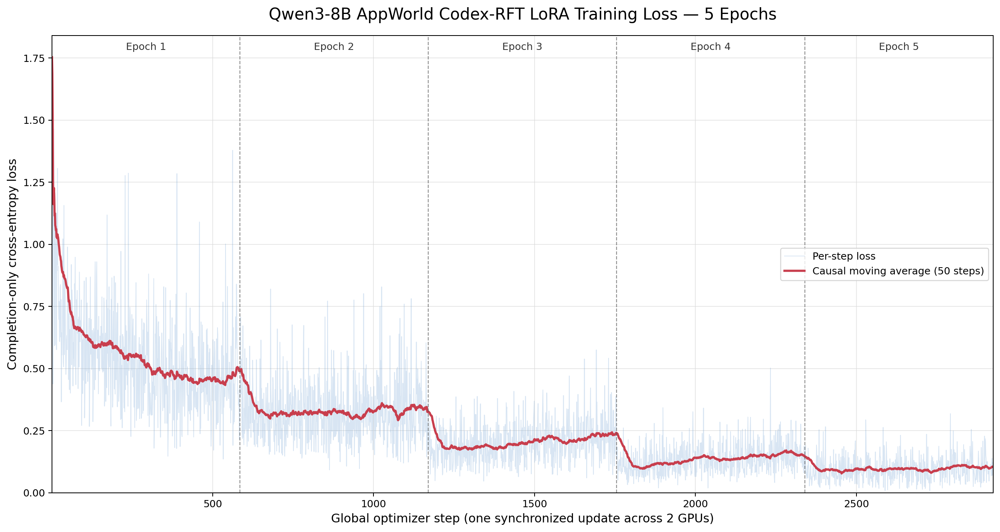
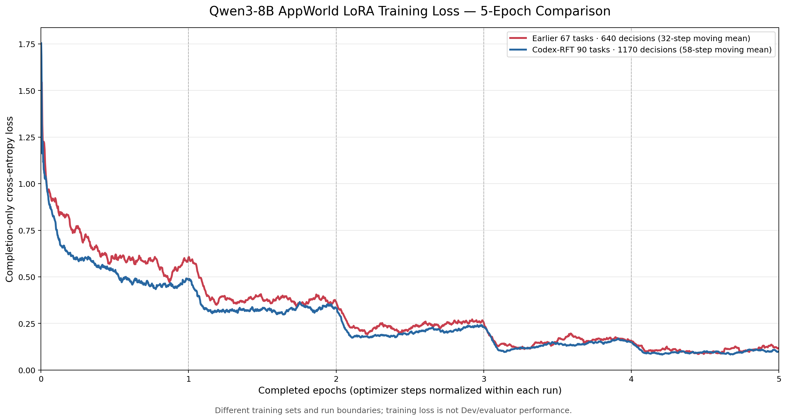

# AppWorld Codex-RFT train90：Qwen3-8B LoRA 微调报告

## 1. 结论

本次训练状态为 **SUCCESS**。Qwen3-8B 已在全部 90 个 AppWorld
train 任务、90 条 Codex 成功轨迹转换得到的
1170 条决策级样本上完成 5 个连续 epoch 的 completion-only LoRA SFT。
两张 GPU 均参与 NCCL/DDP，同步更新 2925 步；保存后的 adapter
已从磁盘重新加载并通过单样本 ReAct Python 生成检查。

最终 adapter：`/root/autodl-tmp/workspace-tw/experiments/2026-09-21_015238_appworld_qwen3-8b_lora_codex_rft_train90_epoch5/artifacts/adapter`

## 2. 数据边界与训练契约

- 数据目录：`/root/autodl-tmp/workspace-tw/data/2026-09-21_appworld_codex_rft_qwen3-8b_sft_train90`
- 原始 `train.jsonl` SHA-256：`1f5ea51ea22ce7ef6b84d3e16bbb25976179064f7c8d0483ab7dcb0118ed3220`
- 官方 evaluator 成功任务：90 / 90
- 独立 Codex thread：90
- 难度 1/2/3：36 / 36 / 18
- raw observation 进入训练：False
- ground truth 进入模型消息：False
- 敏感值泄漏：0
- loss：只监督当前 assistant completion；prompt 与 padding label 均为 `-100`
- Qwen chat template：`enable_thinking=False`

训练输入长度（token）为 min=3181、p50=7249、p95=16040、
max=37015、mean=8239.35；completion 长度为 min=28、
p50=60、p95=189、max=418、
mean=80.81。共有 6 条超过 32,768 token，
因此本实验使用 Qwen3-8B 原生上限 40960，实际截断样本为
0 条。

## 3. 训练配置

- 基座：`/root/autodl-tmp/models/Qwen3-8B`
- LoRA：r=8，alpha=16，dropout=0.0
- 注入层：q/k/v/o projection 与 gate/up/down projection
- 精度 / attention：bfloat16 / sdpa
- 每卡 batch / 全局 batch：1 / 2
- optimizer：AdamW，learning rate=0.0002，weight decay=0.0
- epoch / optimizer step：5 / 2925
- 可训练参数：21,823,488 / 8,212,558,848（0.2657%）
- 训练与诊断验证耗时：21523.70 秒

最长两条样本先独立执行了真实 forward/backward/update smoke，最大长度为
37015 token，状态为 SUCCESS。

## 4. Loss 与诊断

- 前 50 步平均训练 loss：0.825821
- 后 50 步平均训练 loss：0.104539
- 最后一步训练 loss：0.106543
- 训练内诊断 loss：0.048540
- 训练内诊断 perplexity：1.049737

诊断集从每个训练任务各取最后一个决策，共 90 条，且它们
全部已参与训练。因此这两个诊断数值只能检查数值稳定性和拟合状态，**不能解释为 Dev 泛化性能**。
是否提升必须使用独立 AppWorld Dev 和官方 evaluator，与相同基座/推理配置的零样本及旧 adapter 对照。

## 5. 双卡与显存证据

| rank | GPU | 峰值 allocated | 峰值 reserved |
|---:|---|---:|---:|
| 0 | NVIDIA RTX PRO 6000 Blackwell Server Edition | 89.77 GiB | 91.21 GiB |
| 1 | NVIDIA RTX PRO 6000 Blackwell Server Edition | 90.48 GiB | 92.26 GiB |

逐秒 GPU 记录保存在 `logs/gpu_usage.csv`。

## 6. Adapter 重载检查与产物

- 重载生成状态：PASS
- 样本：`07b42fd_1::assistant-0012`
- 输入 / 生成 token：8161 / 35
- 非空 Python fenced code block：1
- adapter 权重 SHA-256：`c8fdfd4f3bb198381b6f2e56d019589a3ed904241b0147b565ec540449a29938`
- 完整结构化指标：`artifacts/metrics.json`
- 训练配置与数据哈希：`config/training_config.json`
- 全流程日志：`logs/`

本实验只完成训练及格式/重载验证，没有在此流程中运行 AppWorld Dev；因此报告不作准确率上升保证。

## 7. 五轮 Loss 曲线与先前 67 题实验对比

本次实验的五轮曲线沿用[先前 67 题实验的图](../2026-09-15_102913_appworld_qwen3_8b_react_lora_67/metrics/loss_curve_total_5epochs.png)的表达方式：浅蓝色为每步原始 loss，红色为向后 50 步的因果移动平均，虚线为 epoch 分界。提供 [PNG](metrics/loss_curve_total_5epochs.png)、[PDF](metrics/loss_curve_total_5epochs.pdf) 和 [逐步 CSV](metrics/loss_history_5epochs.csv)。

下图将先前 67 题实验与本次 90 题实验画在同一坐标系。两者每轮分别为 320 和 585 个优化步，因此横轴采用“已完成 epoch 数”（全局步数除以各自每轮步数），避免直接比较全局步数。两条线均为覆盖约 0.1 个 epoch 的因果移动平均：旧实验 32 步，本次实验 58 步。提供 [PNG](metrics/loss_curve_compare_67_vs_90_5epochs.png)、[PDF](metrics/loss_curve_compare_67_vs_90_5epochs.pdf) 和 [数值摘要](metrics/loss_comparison_summary.json)。

| epoch | 先前 67 题平均训练 loss | 本次 Codex-RFT 90 题平均训练 loss |
|---:|---:|---:|
| 1 | 0.650503 | 0.542399 |
| 2 | 0.380826 | 0.326264 |
| 3 | 0.236069 | 0.202874 |
| 4 | 0.150793 | 0.134637 |
| 5 | 0.106259 | 0.095584 |

两次实验的基座、LoRA 注入方式、全局 batch、学习率以及逐步 loss 计算脚本相同；本次曲线在每轮的平均训练 loss 均较低。但这**不是严格的模型优劣比较**：训练任务数、决策样本数、轨迹来源及内容均不同；上下文上限分别为 32,768 与 40,960 token；先前实验在第 1 轮后重置了 AdamW 状态，而本次为单次连续五轮训练。因此，图只能描述各自训练集上的拟合过程，不能据此断定本次模型的 AppWorld Dev 成功率更高。公平结论仍需在同一 Dev 集、同一推理配置下使用官方 evaluator 对照。
